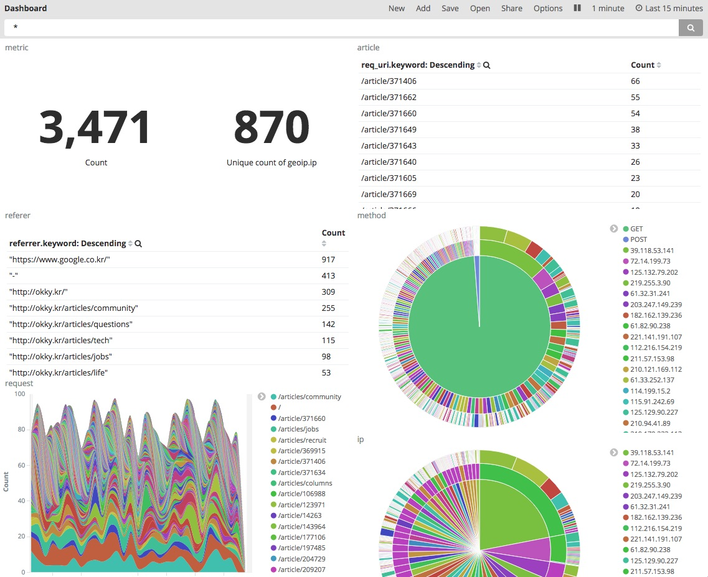

* https://github.com/d3/d3/wiki/Gallery#basic-charts
* http://getbootstrap.com/getting-started/

* facebook business

* Youtube dashboard

* Kibana dashboard

* speedometer
  * https://sindro.me/t/speedometer/speedometer.html

* gauge
  * http://bernii.github.io/gauge.js/

* odormeter
  * http://github.hubspot.com/odometer/
    * http://jsfiddle.net/adamschwartz/rx6BQ/
